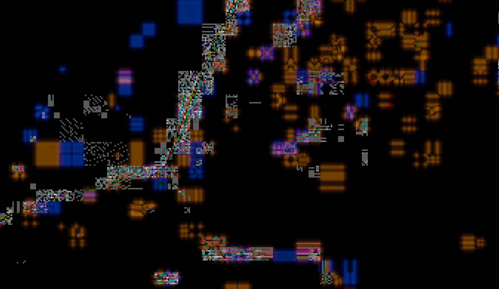

# What is this?

My goal was to detect exact-duplicate frames in some 2D animation footage. When I started this project I had no idea if this goal was reasonable or not (turns out it is a lot harder than I expected, this codebase hasn't achieved that goal yet).

## The Setting

My initial assumptions:
   1. Subsequent frames with no visually noticeable difference would have identical or nearly-identical digital pixel values.
   2. Because I was working with simple 2D animation, subsequent frames wouldn't have any sensor noise, and would be easily detectable.
   3. Calculating the "difference" between two frames was a straightforward concept.

Some limitations:
   1. I would work with the frames extracted into individuals images instead of inside the codec (H.264) for simplicity reasons.
   2. I didn't want to use any AI or neural networks as they would never offer a 100% confidence rating (and there seemed to be value in having a definite algorithm).
   3. I wasn't using existing image comparison techniques ([perceptual hashes](https://en.wikipedia.org/wiki/Perceptual_hashing)) as they were also based on fuzzy comparisons.

## The Setup

The H.264 video I had on hand was encoded as YUV with 4:2:0 subsampling. 

I initially looked for an image format that supported YUV so I didn't have to lose anything to the color conversion process, but sadly none of the popular formats were suitable. WebP is the only one with YUV support, but only in [lossy encoding mode](https://developers.google.com/speed/webp/faq#what_color_spaces_does_the_webp_format_support). 

I then spent some time trying to find a lossless conversion method between YUV and RGB. The results were mixed, confusing, and I found indications that there are multiple *different* equations used in the process. 

I ran an experiment with FFmpeg where I extracted a frame as raw YUV, converted it to PNG, back to YUV, back to PNG, rinse repeat.
Here's a crop of the source image:

Here's what it looked like after being converted between PNG and raw YUV a thousand times over (steady state was reached around 650)

Through manual testing I found that using `-sws_flags +accurate_rnd+full_chroma_int` on FFmpeg during the conversion process resolved this issue. It still introduced minor noise, but reached steady state after a small number of conversions and more importantly, still looked visually equivaelent to the source.

In the end I settled on PNG with 16 bits per channel with the hope that expanding to a bigger bit depth would reduce round-off errors in the conversion process.

It ended up being a long journey into pixel formats, colorspaces, and the fundamental details of digital color representation. It's a lot more complex than I ever realized and a frequently misunderstood topic, which made finding accurate, specific, and useful documentation difficult. The journey was also filled with H.264 quantization noise, but more on that later.

# What approaches have I tried?

First I extract all the frames into 48-bit RGB PNG files using FFmpeg using its `-sws_flags +accurate_rnd+full_chroma_int` arguments to get better color conversion (the [docs](https://ffmpeg.org/ffmpeg-scaler.html#toc-Scaler-Options) are not very specific about what these flags do but my own testing showed they led to less [generation loss](https://en.wikipedia.org/wiki/Generation_loss) over repeated conversions.

1. For every RGB subpixel value in two subsequent frames, compute `abs(subpixel1 - subpixel2)` and generate a "difference frame" from all these computations (this is generally equivalent to putting two images in an editing program and setting the blending mode to "difference"). I would then take the difference frame and find the intensity percentage of every subpixel value and tally them up in a spreadsheet.
   1. Unfortunately two frames that appeared visually identical, when compared pixel by pixel, would usually have small changes in exact color value.
   2. Here's an excerpt image of two identical looking frames overlaid in Gimp 2.10.20r1, blended with difference mode and merged down into one, then the exposure cranked way up:  I'm fairly certain this is H.264 quantization patterns and noise (especially the blue and orange patterns), only so clearly seen because the encoder input was so similar, but if anyone has better explanation, please let me know!
2. Part 2

# Story of this project

## Duplicate frames in animated content? Sounds easy.

You sound like me when I started this project!

My original premise was that `there would be no difference between two subsequent frames where no noticeable visual changes take place`. Definitely untrue for live action footage due to [sensor noise](https://en.wikipedia.org/wiki/Image_noise#In_digital_cameras). But animated content doesn't use a real camera. It's also ideal because there are many frames where nothing moves. Static shots, animation drawn to [not update every frame](https://en.wikipedia.org/wiki/Inbetweening#Frame_frequency), and simple visuals gave me hope that I could precisely detect duplicate frames.

I looked for existing software to do this task. And it exists, but nothing promised to truly detect duplicates. It only promised to detect frames that [do not differ greatly](https://ffmpeg.org/ffmpeg-filters.html#mpdecimate) from the previous frame. There were also some image-based solutions that worked based on [perceptual hashing](https://en.wikipedia.org/wiki/Perceptual_hashing) which is itself based on similarity. At this point I didn't understand why every algorithm was designed to do fuzzy comparisons.

The first problem was getting access to the video data. I couldn't think of a good reason to spend the extra effort parsing the raw H.264 data myself so I settled for extracting the frames with FFmpeg, which is basically the swiss army knife for video file manipulation.

### But what image format to extract to?

FFprobe (FFmpeg's sibling that does video file analysis) tells me that my video is "yuv420p".

I'm used to thinking of RGB `(red intensity, green intensity, blue intensity)`, but YUV is `(luminance intensity, blue difference, red difference)`. The "420" references to 4:2:0 [chroma subsampling](https://en.wikipedia.org/wiki/Chroma_subsampling). Color scientists figured out a long time ago that human eyes are more sensitive to changes in brightness/intensity/luminance than they are sensitive to changes in color. So somebody smartly decided that while storing that beautiful 1080p video footage, they should store the Y' luma channel in full resolution, but store the U and V color channels in a lower resolution, thereby saving a lot of bits. And turns out, you can barely tell a difference.

Now one of the great tragedies of digital video is that you lose some data almost every time you have to convert or encode something. There's too many reasons why this happens to explain them all, but the general rule of thumb is that you want to do a few conversions as possible in order to preserve quality.

